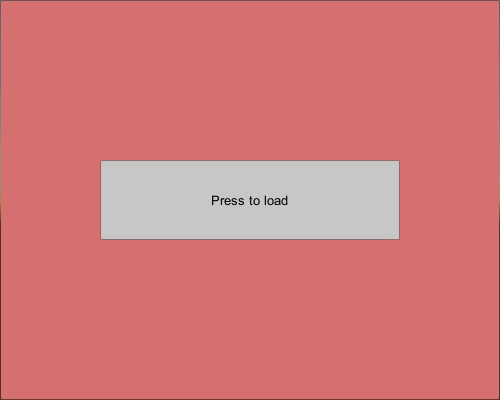

# Loading-Screen-Unity



Solution for screen loading which depends on asynchronous operations, to enable dynamic display of the loading phase,

**ProgressYieldInstruction** which inherited from **CustomYieldInstruction** ,is the base class for other implementations.

For example adapters for legacy yield instruction like WaitForSecondsRealTime & UnityWebRequestAsyncOperation

Then the API can be used to perform ongoing events, OnStart, OnFinish & OnCustomEvent depends on the values received.

    ```
    public float progress = 0;
    
    public IEnumerator CustomYieldSuspend(ProgressYieldInstruction customYieldProgress)
    {
        OnStart?.Invoke();
        while (customYieldProgress.MoveNext())
        {
            // Update progress value (in range [0,1])
            progress = customYieldProgress.Progress;
            OnCustomEvent?.Invoke();
            yield return null;
        }
        OnFinish?.Invoke();
    }
    ```
    
Provides generic solution for suspending execution, while running async operations(down loading, scene loading and waitforseconds).
In addition it allows components on the loading screen, to dynamically display the execution process.
